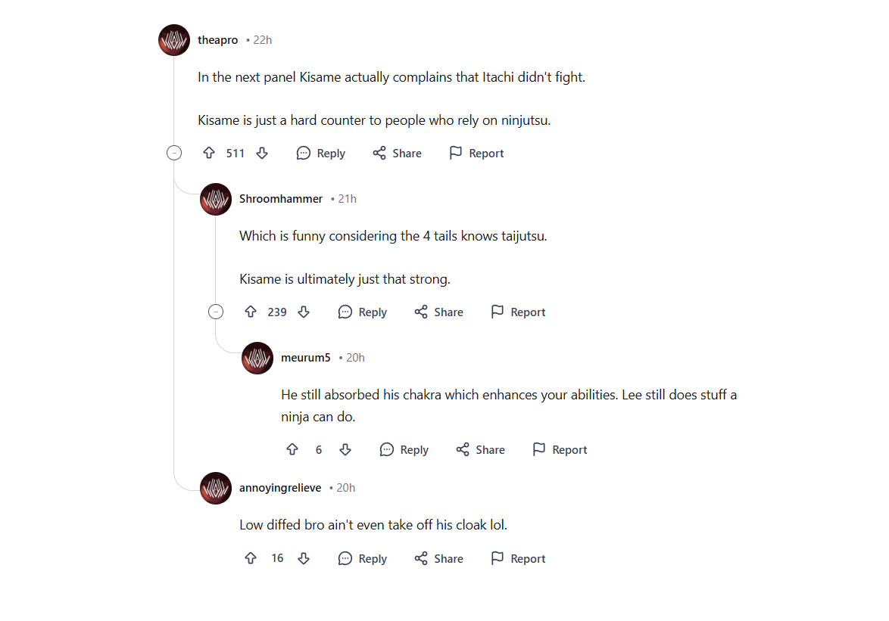

# Threaded Comments Demo

A Reddit-style hierarchical (threaded) comment system. This project is built with Next.js and features a complex reply system and interactive UI elements.



## Features

- **Hierarchical Threads:** Display comments in a nested hierarchy similar to Reddit.
- **Hover Effect:** Highlighting of left thread lines when hovering over a comment.
- **Collapse/Expand:** Ability to toggle visibility of comment threads.
- **Reply System:** Integration for writing replies to any comment.
- **Dummy Data:** Pre-configured with fake data for testing and demonstration.
- **Responsive Design:** Optimized for both mobile and desktop devices.

## Tech Stack

- **Framework:** Next.js 15+ (App Router)
- **UI:** Tailwind CSS
- **Icons:** Lucide React
- **Language:** TypeScript

## Installation and Setup

From the project root:

```bash
npm install
npm run dev
```

Open `http://localhost:3000` in your browser.

## Project Structure

- [src/app/page.tsx](src/app/page.tsx) - Main page entry point.
- [src/shared/components/CommentsSection.tsx](src/shared/components/CommentsSection.tsx) - Container for threaded comments.
- [src/shared/components/CommentItem.tsx](src/shared/components/CommentItem.tsx) - Individual recursive comment component.
- [src/shared/fake/comments.ts](src/shared/fake/comments.ts) - Sample dummy comment data.
- [src/shared/types/comment.ts](src/shared/types/comment.ts) - TypeScript definitions for comments.

## Deployment (Vercel)

- Import the repository to Vercel.
- Set **Root Directory** to `threadedcomments` (if applicable).
- Build Command: `npm run build`
- Output: default (Next.js)

## Usage Notes

- Click the vertical line next to a comment author to collapse or expand a thread.
- Clicking the "Reply" button opens a form to add a new response.
- The hover effect is scoped: parent thread lines highlight when hovering the parent comment or its direct reply blocks, but hovering inside a nested reply-of-reply does not highlight the topmost parent lines (Reddit-like behavior).
